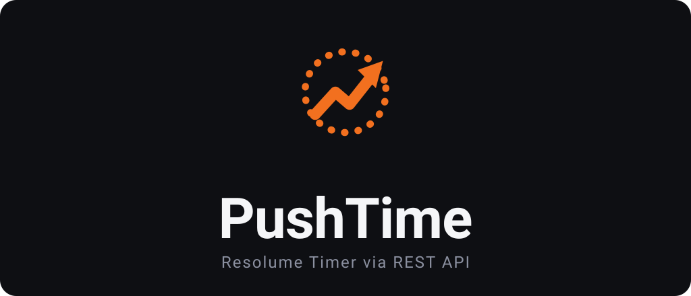
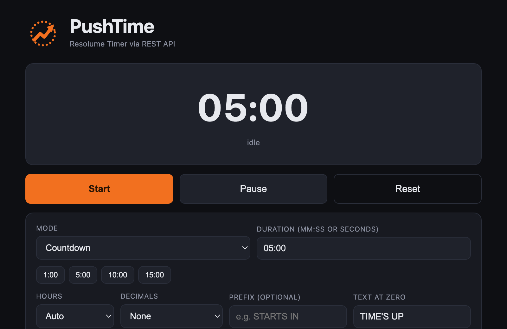

  

  A single HTML file that turns Resolume Arena's native Text source or effect into a live show timer. 
  No Wire patch, no plugin, no install.

  
  
  

  

---

## What it is

PushTime drives a **Text Block** or **Text Animator** in Resolume Arena from a small web page. It writes the
timer value straight into Arena's own text parameter over the built-in REST API, so the text on screen uses
your real font, styling, glow, outline and cascade animation — it just happens to count.

Open `index.html` in a browser, point it at the clip (or layer effect) holding your text, and hit start.

## Why it works this way

The obvious approach is to build the timer in **Wire**. The problem: a Wire plugin renders its own text, so
you lose Arena's font picker and text styling, and a Wire plugin can't push values back to its host. Feeding
Arena's *native* Text source from outside avoids all of that.

OSC could carry the text, but a browser can't send raw OSC/UDP. So PushTime talks to Arena's **web API**
instead — and that turned out to be the better path:

- Writing a parameter is one HTTP call: `PUT /api/v1/parameter/by-id/{id}` with `{"value":"01:23"}`.
- Arena's webserver returns permissive CORS headers (`Access-Control-Allow-Origin: *`), so a plain HTML page —
  even opened from `file://` — can call it directly. No bridge, no proxy.
- The WebSocket API lets the page *listen* too, so a clip trigger in Arena can start and stop the timer.

The result: one file, zero dependencies, and a timer that looks like any other text clip in your composition.

## Quick start

1. In Arena: **Preferences → Webserver → Enable Webserver & REST API** (default port `8080`).
2. Put a **Text Block** or **Text Animator** on a clip (or add it as an effect on a clip/layer).
3. Open [`index.html`](index.html) in a browser.
4. Set **Host/Port**, choose **Clip** or **Layer** and enter the **Layer/Clip** numbers, then click **Resolve**.
5. Pick the text parameter, press **Start**. The clip must be triggered and its layer visible to show on output.

> Tip: use the **Test** button first to confirm the page can reach Arena.

## Features

- **Modes** — countdown, count-up (elapsed), time of day, countdown to a wall-clock time, and countdown to a date.
- **Formatting** — pick a style: digital (`HH:MM:SS`), with days (`5d 03:12:45`), days only (`5 days`), worded
  (`4 days 9 hours 44 minutes 14 seconds`), or fully spelled out (`four days nine hours forty-four minutes
  fourteen seconds`). Unit labels are editable for any language. Plus optional always-on hours and
  tenths / hundredths / milliseconds, with sub-second updates rate-limited so the display stays smooth.
- **Any text target** — a Text source on a clip, or a Text Block / Text Animator added as an **effect** on a
  clip or a layer. Resolve scans the target and lists every text parameter it finds; you pick one.
- **Prefix & end text** — e.g. `STARTS IN ` and `TIME'S UP`.
- **Follow play state** — optionally tie the timer to the clip: connecting it starts the timer, disconnecting
  stops and resets (over Arena's WebSocket; clip targets only).
- **Copy as OSC** — copies the text parameter's OSC address for use in other tools (clip sources).

## How it works (technical notes)

Verified against Arena 7's web API on `localhost:8080`:

| Action | Call |
|---|---|
| Write text | `PUT /api/v1/parameter/by-id/{id}`  body `{"value": "<text>"}` → `204` |
| Read a clip/layer | `GET /api/v1/composition/layers/{L}/clips/{C}` (or `/layers/{L}`) |
| Listen for triggers | WebSocket `ws://host:8080/api/v1`, `{"action":"subscribe","parameter":"/composition/layers/{L}/clips/{C}/connected"}` |

- Parameters are written by **id** (read it from the clip/layer JSON), not by tree path.
- The WebSocket pushes `parameter_subscribed` on subscribe and `parameter_update` on change; a clip is
  triggered when its connected state becomes `Connected`.
- OSC text address (for clip sources): `/composition/layers/{L}/clips/{C}/video/source/textgenerator/text/params/lines`.
  Arena's OSC clip index matches the grid column. (OSC input is separate from the REST webserver and is off by
  default — enable it under Preferences → OSC if you want to send over OSC.)

## Requirements

- Resolume Arena 7 (Avenue should work too — same API surface).
- A modern browser. Everything runs locally; no data leaves your machine.

## License

[MIT](LICENSE)
